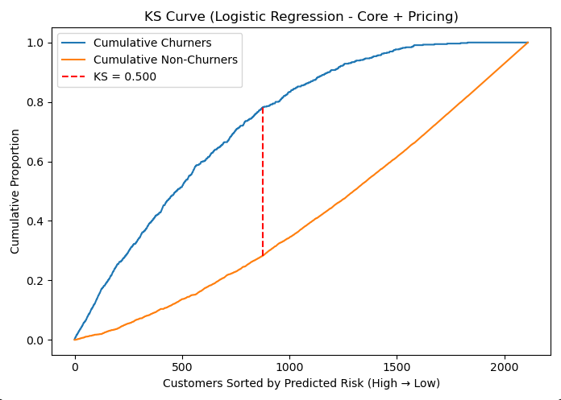
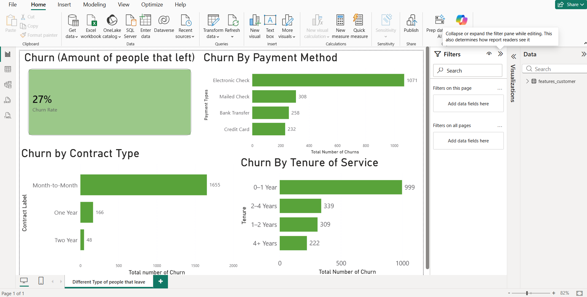

# 📉 Customer Churn Prediction & Analytics

## 📝 Project Overview
This project provides an end-to-end data analytics and machine learning solution to predict customer churn in the telecommunications industry. The goal was to move beyond simply building a statistical model, focusing instead on delivering actionable, revenue-saving business intelligence to both technical and executive stakeholders.

**Tech Stack Used:** SQL, Python (Scikit-Learn, Pandas), Tableau, Power BI

## 🔍 Key Business Findings
Through SQL feature engineering and exploratory data analysis, the primary drivers of customer attrition were isolated:
* **High-Risk Segments:** Customers on **Month-to-Month contracts** and those paying via **Electronic Check** carry a baseline flight risk of >42%.
* **Retention Drivers:** Customers on two-year contracts and those with a tenure exceeding 4 years show a highly stable churn rate of less than 10%.

## 🤖 Predictive Modeling Strategy
A phased Logistic Regression approach was utilized to rank-order customer flight risk. Continuous pricing features were integrated with categorical baseline variables to optimize predictive power.

**Final Model Performance (Model 2):**
* **ROC AUC:** 0.8216
* **KS Statistic:** 0.4998 (Excellent predictive separation)
* **Business Impact (Operational Threshold):** The model successfully rank-orders risk so effectively that targeting just the **top 20%** of high-risk customers captures **45.6% of all total churners**, allowing the business to highly optimize retention budgets. 

 

## 📊 Business Intelligence Dashboards
Dual-audience reporting was implemented to ensure the model's insights were actionable across the organization.

### 1. Executive KPIs (Power BI)
Built for shareholders and executive leadership to track macro-level metrics, total churned customers, and total monthly revenue at risk.

### 2. Technical Diagnostics (Tableau)
Built for the data science team to visualize the distribution of continuous financial variables, identify outliers, and establish the relationships between pricing and customer churn prior to predictive modeling.

**Box Plot of Churn against Total Charge**

> **Insight:** This visualization highlights the variance in lifetime value between retained and churned segments. It visually confirms whether the cumulative amount billed to a customer serves as a stabilizing factor or a flight risk.

**Distribution of Total Charges**

> **Insight:** This density plot reveals the heavy right-skew present in the raw financial data. Exposing this non-normal distribution was a critical diagnostic step, as it directly justified the decision to apply a logarithmic transformation to the `total_charges` variable in our final iteration (Model 3) to improve algorithmic performance.

**Box Plot of Churn against Monthly Charges**

> **Insight:** This plot isolates the immediate price sensitivity of the user base. It demonstrates that customers who churn typically carry a notably higher median monthly bill compared to retained users, reinforcing the strong predictive weight of the `monthly_charges` feature in our logistic regression model.

## 📂 Repository Structure
* `/sql`: Contains `01_clean_churn.sql` and `02_features_churn.sql` used for data cleaning, transformation, and one-hot encoding.
* `/python`: Contains `module1.py` housing the Logistic Regression modeling, testing, and evaluation metrics (ROC AUC, KS Statistic).
* `/dashboards`: Contains the Tableau (`.twb`) and Power BI (`.pbix`) project files.
* `/docs`: Contains the final project summary report and generated PDF portfolio piece.
* `/images`: Contains all exported plots, charts, and dashboard screenshots referenced in this summary.
* `/python`: Contains `module1.py` for the Logistic Regression model, testing, and evaluation metrics.
* `/dashboards`: Contains the Tableau `.twb` and Power BI `.pbix` files.
* `/docs`: Contains the final project summary report and generated PDF portfolio piece.
* `/images`: Contains all exported plots and dashboard screenshots.y** rather than black-box prediction. The workflow reflects common industry practices in churn and risk analytics.

